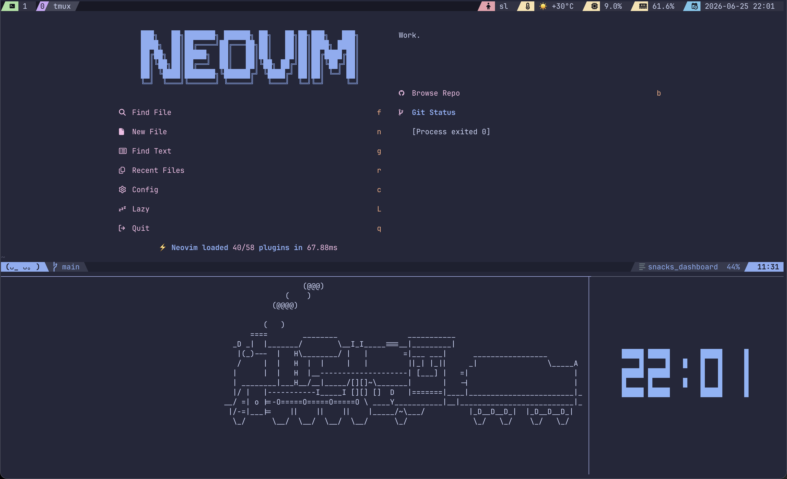

# tmux config

Simple tmux configuration with Catppuccin theme, popup-based tooling, and an IDE layout script.
Configuration designed to work with nvim (maybe [this nvim](https://github.com/Mitra98t/miravim)) and over ssh.



## Requirements

**Mandatory**

- `tmux`
- `git`

**Optional** — needed for the utility popups

- [`lazygit`](https://github.com/jesseduffield/lazygit) — git TUI
- [`btm`](https://github.com/ClementTsang/bottom) — system monitor
- [`yazi`](https://github.com/sxyazi/yazi) — file manager

## Installation

```bash
git clone https://github.com/Mitra98t/miratmux.git ~/.config/tmux
cd ~/.config/tmux
./installation.sh
```

This clones [TPM](https://github.com/tmux-plugins/tpm), installs all plugins, and launches tmux.

### Other installer options

| Flag | Action                           |
| ---- | -------------------------------- |
| `-u` | Update all plugins via TPM       |
| `-c` | Clear the `plugins/` directory   |
| `-d` | Check optional dependency status |
| `-h` | Show help                        |

## Prefix key

The prefix is `~` (tilde). Press `~` twice to send a literal tilde to the pane
(the second `~` is passed down to the application opened in tmux).

## Key bindings

### Session / config

| Binding      | Action        |
| ------------ | ------------- |
| `prefix + r` | Reload config |

### Windows

| Binding      | Action              |
| ------------ | ------------------- |
| `prefix + Q` | Kill current window |
| `prefix + P` | Next window         |
| `prefix + J` | Previous window     |

### Panes

| Binding                       | Action             |
| ----------------------------- | ------------------ |
| `prefix + \` or `prefix + h`  | Split horizontally |
| `prefix + \|` or `prefix + v` | Split vertically   |
| `prefix + q`                  | Kill current pane  |
| `prefix + j`                  | Focus pane left    |
| `prefix + k`                  | Focus pane down    |
| `prefix + l`                  | Focus pane up      |
| `prefix + p`                  | Focus pane right   |

### Utility popups

| Binding      | Action                                       |
| ------------ | -------------------------------------------- |
| `prefix + G` | Lazygit (80×80% popup, cwd-aware)            |
| `prefix + B` | Bottom system monitor (90×90% popup)         |
| `prefix + Y` | Yazi file manager (persistent session popup) |

### IDE layout

| Binding          | Action                     |
| ---------------- | -------------------------- |
| `prefix + w + i` | Open IDE layout            |
| `...`            | Other layouts will come... |

The IDE layout splits the current window into three panes: a large main pane, a bottom-left terminal (25% height), and a bottom-right terminal (25% width × 25% height).

## Plugins

| Plugin                                                            | Purpose                   |
| ----------------------------------------------------------------- | ------------------------- |
| [tpm](https://github.com/tmux-plugins/tpm)                        | Plugin manager            |
| [tmux-sensible](https://github.com/tmux-plugins/tmux-sensible)    | Sane defaults             |
| [catppuccin/tmux](https://github.com/catppuccin/tmux)             | Catppuccin theme          |
| [tmux-cpu](https://github.com/tmux-plugins/tmux-cpu)              | CPU/RAM status modules    |
| [tmux-weather](https://github.com/xamut/tmux-weather)             | Weather status module     |
| [tmux-resurrect](https://github.com/tmux-plugins/tmux-resurrect)  | Save and restore sessions |
| [tmux-continuum](https://github.com/tmux-plugins/tmux-continuum)  | Automatic session saving  |
| [tmux-which-key](https://github.com/alexwforsythe/tmux-which-key) | Which-key menu            |

## Status bar

The status bar sits at the top of the screen.

- **Left:** current session name · windows
- **Right:** active application · weather · CPU · RAM · date/time

## File structure

```
tmux.conf          # entry point - options, plugin list, sources other files
binding.conf       # key bindings
utility.conf       # popup and IDE bindings
catppuccin.conf    # theme and status bar layout
scripts/ide        # IDE pane layout script
installation.sh    # setup and plugin management script
```

